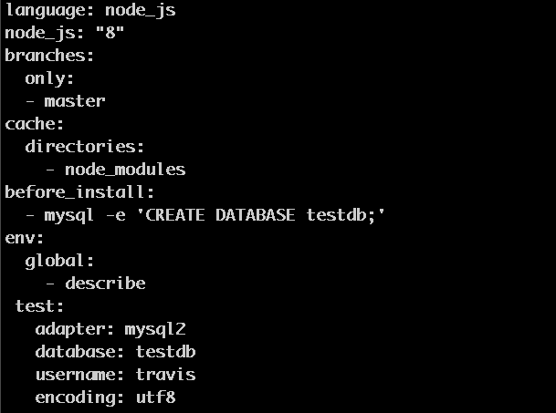

# Travis MySQL Test Solution

#### Travis will run tests and it will look for the mysql user.
#### Travis have defined mysql users `travis` and `root` with a blank password.

#### To set this user for testing you can use the `.travis.yml` file,

### open the `.travis.yml` and make sure you have this lines.

 >> test: 
 >> adapter: mysql2 
 >> database: <YOUR_DATABASE_NAME> 
 >> username: travis 
 >> encoding: utf8 
 
 ## Make Sure that your <YOUR_DATABASE_NAME> matches with:
 
 >> before_install:
 >> mysql -e 'CREATE DATABASE <YOUR_DATABASE_NAME>;'
 >>

#### So your `.travis.yml` should look like:
  (in this case the database name its testdb)

